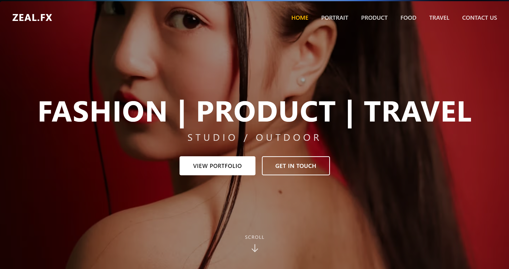

# Zeal.fx 🎨

A modern, elegant portfolio website built with Next.js and TypeScript, showcasing creative work across fashion, products, and food categories.
## 🌐 Live Website
[https://zealfx.vercel.app](https://zealfx.vercel.app)

## 📖 Description

**Zeal.fx** is a full-featured creative portfolio platform designed to showcase work in multiple categories. It features a sleek, responsive design with smooth animations and intuitive navigation. The platform includes portfolio galleries, project details with image carousels, contact functionality, and an inspirations section to keep creators inspired.

Perfect for photographers, designers, creative directors, and anyone looking to build a stunning online presence.

## 📸 Screenshot



## 🚀 Features

- **Multi-Category Portfolio**: Showcase work in Fashion, Product, and Food categories
- **Project Galleries**: Beautiful grid layouts with project cards
- **Lightbox Modal**: Image carousel with detailed project information
- **Responsive Design**: Mobile-first approach, works seamlessly on all devices
- **Smooth Animations**: Framer Motion-powered transitions and interactions
- **Contact Form**: Full-featured contact form with validation
- **Contact Information**: Display social links and contact details
- **Sticky Navigation**: Always-accessible navigation bar
- **Scroll-to-Top**: Convenient button to jump back to top
- **Cookie Consent**: GDPR-compliant cookie banner
- **SEO Optimized**: Open Graph metadata for social sharing

## 🛠️ Tech Stack

### Frontend & Framework
- **Next.js 16.1.6** - React framework for production
- **React 19.2.3** - JavaScript library for building user interfaces
- **TypeScript 5** - Type-safe JavaScript

### Styling & UI
- **Tailwind CSS 4** - Utility-first CSS framework
- **Framer Motion 12.29.2** - Animation library for React
- **Swiper 12.1.0** - Modern carousel slider component
- **Headless UI 2.2.9** - Unstyled, accessible components
- **Heroicons 2.2.0** - Beautiful hand-crafted SVG icons

### Utilities
- **clsx 2.1.1** - JavaScript utility for constructing className strings
- **Tailwind Merge 3.4.0** - Merge Tailwind CSS classes without conflicts

### Development & Testing
- **Jest 30.2.0** - JavaScript testing framework
- **Testing Library** - React component testing utilities
- **ESLint 9** - JavaScript linter
- **Prettier 3.8.1** - Code formatter
- **Babel React Compiler** - React compiler for optimized rendering

### Deployment
- **Vercel** - Optimized Next.js hosting

## 📁 Project Structure

```
zeal/
├── src/
│   ├── app/                    # Next.js App Router pages
│   │   ├── api/contact/        # Contact form API endpoint
│   │   ├── fashion/            # Fashion portfolio page
│   │   ├── product/            # Product portfolio page
│   │   ├── food/               # Food portfolio page
│   │   ├── contact/            # Contact page
│   │   ├── inspirations/       # Inspirations page
│   │   ├── globals.css         # Global styles
│   │   ├── layout.tsx          # Root layout with navbar/footer
│   │   └── page.tsx            # Home page
│   ├── components/             # React components
│   │   ├── Navbar.tsx          # Sticky navigation bar
│   │   ├── Hero.tsx            # Full-screen hero section
│   │   ├── About.tsx           # Biography with expand/collapse
│   │   ├── PortfolioGrid.tsx   # Portfolio gallery grid
│   │   ├── ProjectCard.tsx     # Individual portfolio item
│   │   ├── ProjectModal.tsx    # Lightbox modal with carousel
│   │   ├── ContactForm.tsx     # Contact form with validation
│   │   ├── ContactInfo.tsx     # Contact details & social links
│   │   ├── Footer.tsx          # Site footer
│   │   ├── ScrollToTop.tsx     # Scroll-to-top button
│   │   └── CookieBanner.tsx    # Cookie consent banner
│   └── lib/
│       └── utils.ts            # Utility functions (cn helper)
├── public/
│   └── assets/                 # Static assets
│       ├── hero.jpg            # Hero background image
│       ├── about-bg.jpg        # About section background
│       ├── og-image.jpg        # Open Graph image
│       └── portfolio/          # Portfolio images
├── __tests__/                  # Jest test files
├── package.json
├── tailwind.config.ts
├── next.config.ts
└── README.md
```
